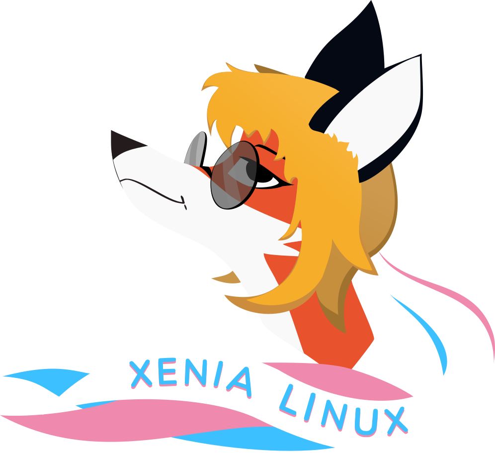

    

<h2 align="center"><b>🦊🏳️‍⚧️ Xenia Art by Chimmie Firefly</b></h2>

### About

Welcome, here's a public repository of Xenia art made by Chimmie Firefly.
Feel free to explore it at [xenia.chimmie.k.vu](https://xenia.chimmie.k.vu) website.

### Usage

Most of my art is under **CC0 1.0** license, which means you can do whatever you like with my art. :3

### Contributing

If you want to modify my art and make it better - you can do it so.
If you want to improve the style of my Xenia website - you're in the right place.

Simply:
1. Fork the repository (after registering/logging in).
2. Clone your forked repository using `git` tool with an LFS addon (for handling binary files).
3. Add / modify files in the forked repository.
4. Use `git add -A && git commit -S -m "My great changes."` to commit your changes into the fork.
5. `git push -u origin main` to push your changes.
6. Create pull request from the web UI. From there I'll assist you further.
